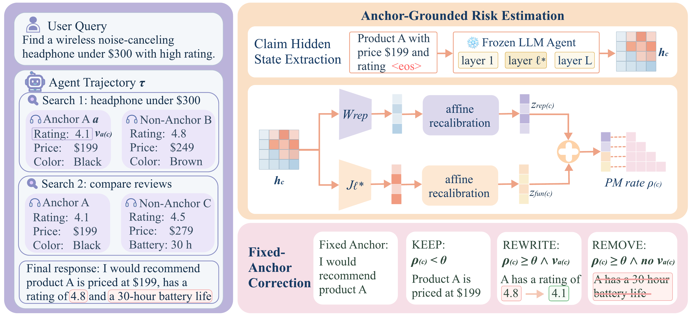
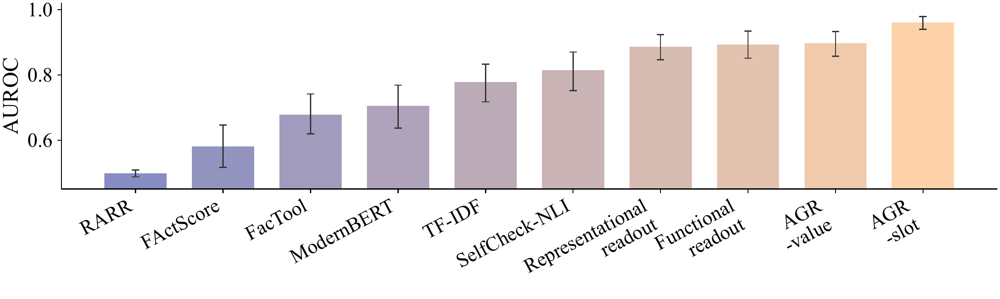

# Phantom Merge

**When Your Large Language Model Agents Pick One but Tell You About Another**

An agent can complete a task successfully yet describe its chosen entity using evidence from somewhere else. **Phantom Merge** studies this failure of entity–evidence binding: individually plausible claims become incorrect when attributed to the wrong entity. We introduce **Anchor-Grounded Risk (AGR)** to detect claim-level binding errors through representational and Jacobian-based functional readouts, and **Fixed-Anchor Correction (FAC)** to revise or remove flagged claims using the committed entity’s evidence. This repository connects the methods to their experimental evidence, with executable implementations, frozen evaluation artifacts, and reproducible analysis.



Paper: [docs/paper.pdf](docs/paper.pdf)

## Setup

```bash
python3 -m venv .venv && source .venv/bin/activate
pip install -e ".[reproduce]"
export PHANTOM_MERGE_ROOT="$(pwd)"
```

## Verify and reproduce paper numbers

Level 1 (CPU, no GPU or Hugging Face weights):

```bash
phantom-merge reproduce --bundle results --out outputs/metrics
phantom-merge verify --bundle results --results outputs/metrics
pytest tests -q
```

- **`phantom-merge reproduce`** — recomputes AUROC/AP for the four Shopping test readouts from `results/rq2/table2_prf_audit/per_claim_scores_test274.jsonl` (274 claims; 156 PM / 118 CB).
- **`phantom-merge verify`** — compares readouts to [docs/reference_values.json](docs/reference_values.json) (submission reference numbers).
- **`pytest tests`** — lightweight regression on the L1 score path.

Full pipeline (gold, rollouts, activations, mitigation reruns): `source reproduce/env.sh` and see [reproduce/REPLICATION.md](reproduce/REPLICATION.md) with [reproduce/DATA_SYNC_MANIFEST.json](reproduce/DATA_SYNC_MANIFEST.json).

## Layout

| Directory | Contents |
|-----------|----------|
| `ccer/` | AGR, FAC, pipelines, adjudication helpers |
| `scripts/` | Table and experiment drivers |
| `configs/` | Model/dataset configs, `method_registry.yaml` |
| `results/` | Frozen scores, splits, audit JSON (see `results/MANIFEST.json`) |
| `reproduce/` | Env, data-sync list, shell entrypoints, Level-1 CLI (`phantom-merge`) |
| `third_party/` | Jacobian-lens, RARR |
| `assets/` | Framework figure; appendix baseline AUROC bar chart |
| `docs/` | Paper PDF, reference values, artifact guide, third-party notices |

## Research and reproducibility

### Beyond task completion: grounding claims in the right entity

Task success and factual support do not, by themselves, establish that a response describes the entity the agent actually selected. Phantom Merge makes this distinction explicit at the claim level, covering cross-entity misattribution, constraint-to-anchor projection, and contradictions of observed anchor attributes. The framework connects diagnosis to intervention: AGR estimates binding risk from the frozen agent’s internal state, while FAC uses functional auditing and anchor-specific evidence to guide correction.

### Combining representational and functional readouts

On the held-out Shopping cohort of **274 claims from 243 trajectories**, AGR-slot achieves **0.962 AUROC and 0.973 average precision** with Qwen3-32B. The release includes aligned per-claim scores for the representational, Jacobian-slot, AGR-value, and AGR-slot readouts, enabling direct comparison on the same examples. AGR-slot combines probe log-odds with slot-level functional information through fixed additive scoring; AGR-value uses calibrated anchor-value fusion.

### Trace results from individual claims to paper metrics

The CPU reproduction path recomputes AUROC and average precision for the **four internal readouts in Table 2**, without downloading backbone weights or rerunning model inference. Each result can be traced to its frozen scores, labels, method definition, and submission reference value. The [artifact guide](docs/ARTIFACT.md) maps paper results to their corresponding files and commands, including template-stratified analyses and available mitigation statistics.

For correction, the implementation separates claim selection, functional auditing, and evidence-grounded rewriting or deletion. These stages make it possible to inspect how FAC acts on a flagged claim, rather than treating mitigation as an opaque post-processing step.

### Reproduction paths and release coverage

The bundled artifacts prioritize the **Qwen3-32B main experiments**. CPU recomputation is available for the frozen Shopping readouts; workflows for rebuilding activations and rerunning mitigation are documented in [REPLICATION.md](reproduce/REPLICATION.md), together with their model and data dependencies.

The additional Gemma, Llama, and Mixtral characterization artifacts, and some cross-domain figure inputs, are not yet fully included. [Artifact coverage](docs/ARTIFACT.md) records availability per paper result, while [DATA_SYNC_MANIFEST.json](reproduce/DATA_SYNC_MANIFEST.json) identifies the external inputs required by the full workflows.



*Appendix-style comparison: vendor baselines and internal readouts on the same Shopping test claims (bootstrap CIs). Source: `results/DETECTION_METRICS_REGISTRY.json`; replot via `scripts/plot_rq2_detection_figures.py`.*

## License

See [LICENSE](LICENSE) and [docs/THIRD_PARTY_NOTICES.md](docs/THIRD_PARTY_NOTICES.md).
